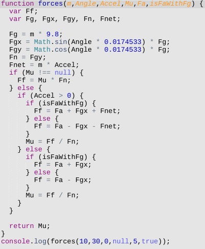

# An Exercise in Cleaning Up Code

Lately, I've been reading _Clean Code_, by Robert C. Martin. I just finished chapter 2, _Functions,_ and to my delight, a student came to me last week with questions about a function he's writing. He's trying to write a script that will help him solve the inclined plane problems he's been getting in his physics class. Here's his solution:

What a beauty! Since it violates almost every Clean Code rule about naming and function-writing, I thought this was a great opportunity to practice what I've been reading.

## My First Rewrite Attempt

For [my first attempt](rewrite.js) at rewriting, I decided to go object-oriented because I thought that I would have to write an abstract factory to deal with the nested conditionals in my student's code. It turned out that I didn't have to have a switch or any flags--I could just rely on the math to handle the different scenarios. In other words, I didn't have to test for the direction of forces--I just stored x and y components of each force inside of the `Force` object instance and let the negative numbers do their own magic.

On the whole, I feel that this version is much more readable and maintainable.

- Names are more descriptive
- Functions do few things (hopefully I've achieved only one thing!)
- No nested conditionals
- No mega-parameter methods

## A Functions-only Rewrite

Since my student is at the beginning of his programming journey, I chose to rewrite his function without objects, too. What I found interesting about doing this is that the length in terms of lines is about the same, but each line of code ended up being shorter. The whole thing feels less verbose because it uses global variables.

I think that if this were packaged up as a JS module, then I'd be tempted to stick with the functional style instead of object-oriented.
